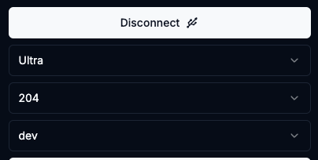

# Build Factory Images With Docker

build-images.sh is a script that builds the factory images with only Docker as a dependency. 

After the images are built the script runs the web flasher to allow flashing the Bitaxe
 with the newly built dev images. It should open your default browser to http://localhost:3000.

## Requirements

Docker must be installed. https://docs.docker.com/get-started/get-docker/

## Building Images

The command is run from the project root `./build-docker/build-images.sh`. To build images for all boards

```shell
./build-docker/build-images.sh -a
```

To build an image for a specific board

```shell
./build-docker/build-images.sh -b 204
```

 If the images were already built previously you can launch the web flasher only with

```shell
./build-docker/build-images.sh -f
```

## Image Location

This build process puts the factory images into the `build-docker` directory.  The images are named `esp-miner-factory-<board>-dev.bin`.  The webflasher is configured to look for these named images.

There will only be one firmware version listed as `dev` in the web flasher.


