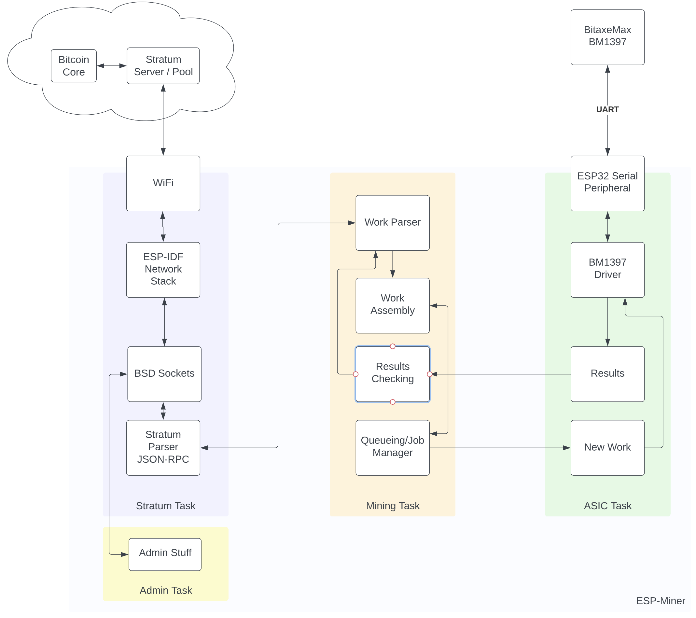

## ESP-Miner

ESP-Miner is bitcoin miner software designed to run on the ESP32. It mines on ASICs such as the Bitmain BM1397. The [BitaxeMax](https://github.com/skot/bitaxe/tree/max) is a handy board for this!

## Architecture
- Uses the ESP-IDF Framework, which is based on FreeRTOS (no Linux involved)
- Uses the ESP32 WiFi to connect to the network
- The ESP32 is provisioned to the local WiFi over BLE using ESP SmartConfig

### Firmware
- ESP-Miner connects to and verifies the attached mining ASIC.
    - Setting the baud rate, hashing frequency, and filling in some other mystery registers
    - This startup-sequence for the BM1387 and BM1397 can be found in cgminer the Kano edition in [driver-gekko.c](https://github.com/kanoi/cgminer/blob/master/driver-gekko.c)

- ESP-Miner connects to your pool or stratum server and subscribes to get the latest work.
    - This is done with [JSON-RPC](https://www.jsonrpc.org)
    - Via the [Stratum](https://braiins.com/stratum-v1/docs) protocol
- ESP-Miner the latest work and formats it to be sent to the mining ASIC.
    - There isn't much change here except for computing the midstates, and shifting some bytes around
        - Beware of endianess!
        - How do we do this? Examples in cgminer Kano edition.
- ESP-Miner sends this work to the mining ASIC over serial.

- The Mining ASIC will report back any when it finds a hash over the difficulty (which)?
    - The catch here is that if it doesn't find a hash over the difficulty, it will not report back at all. So you need to keep track of the hashing frequency and the time so that you can send a new block header to be hashed.

- ESP-Miner will report back to the pool over Stratum the results of mining.

- All of the administrative stuff of running a miner like;
     - Set the BM1397 core voltage and current.
     - check the fan speed
     - check the BM1397 temperature
     - optimize the hashing frequency and core voltage for max efficiency
